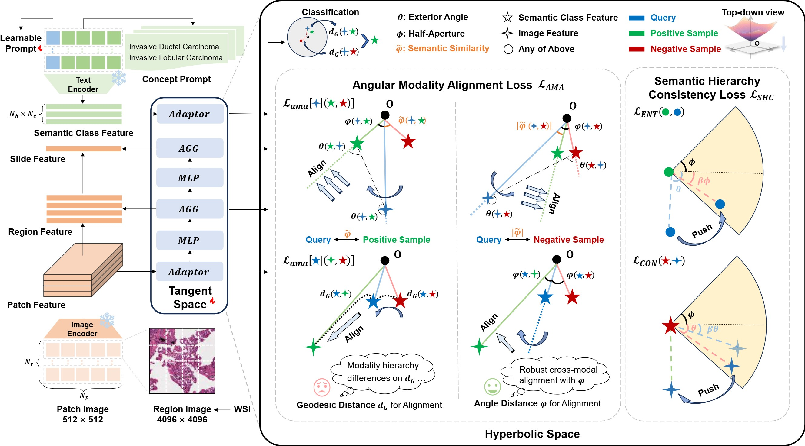

# HyperPath

This is the official code for the paper "HyperPath: Knowledge-Guided Hyperbolic Semantic Hierarchy Modeling for WSI Analysis (MICCAI 2025 Early Accept)".

## Citation

If you find this work useful in your research, please consider citing.

## Acknowledgement

We would like to thank the authors of [CONCH](https://github.com/mahmoodlab/CONCH) and [MERU](https://github.com/facebookresearch/meru) for their excellent work.